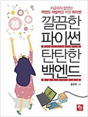
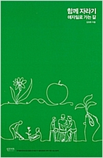
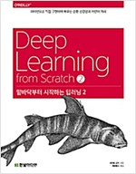
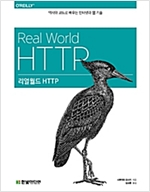
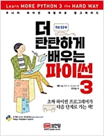
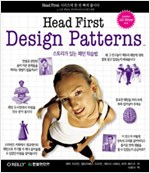

### 책

#### 파이썬 답게 코딩하기

> 상당히 좋은, 파이썬 기본 문법을 익힌 상태에서 보면 좋은 책. (2019.07.31)

#### 탄탄한 파이썬 백엔드

> 읽는 중.

#### 실리콘 밸리 .. 데이타 과학

> 구입만 하고, 아직 못봤다.

#### 함께 자라기

> 한번 읽었는데, 다시 읽어야 ...

#### 밑바닥 부터 시작하는 딥러닝 2

> 아직 못봤다.

#### 앵무새 죽이기

> 한글 번역된거 읽음.(2019.07.30). 원서는 어디있는지 못 찾겠음.

#### 리얼월드 HTTP

> 읽는 중인데, web에 대한 기초가 없이 보기에는 어렵다.

#### 더 탄탄하게 배우는 파이썬 3

> 이런 책을 읽고 싶었다. 연습 문제가 많아서 좋다.
  
#### 헤드퍼스트 디자인 패턴

> 자바도 배우고 패턴도 배우려는, 두마리 토끼 잡으려다 하나도 못잡게 생겼다.

### 참조 페이지  
* python   
`https://github.com/bt3gl/Python-and-Algorithms-and-Data-Structures`